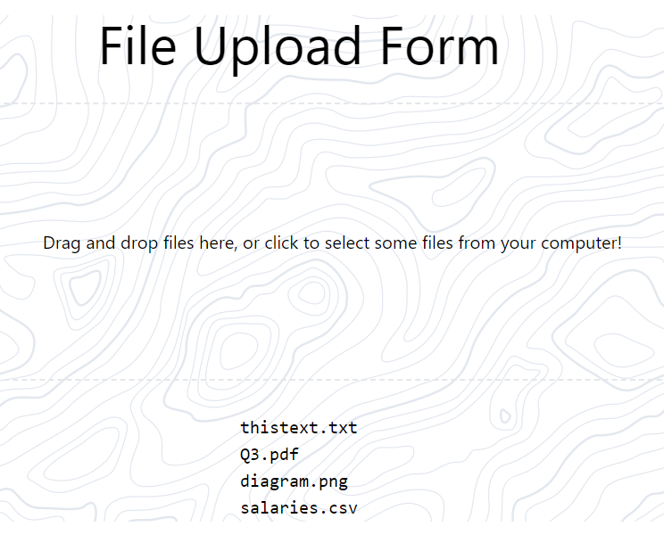

# FileUploadApp

A web application that can accept any type of file, save it to a web server, and display the names of the file to the screen.
This was designed with feasibility, UI/UX, and latency in mind. 

Tech stack used: React.JS, HTML, Tailwind CSS, Node.JS, Firebase, SQL-JS, Material UI

Files have their name and file saved to a firebase cloud server, and in the future a local SQL server. 

Feel free to fork this repo or modify it! Email mmmzzz66g@gmail.com with any questions. 
